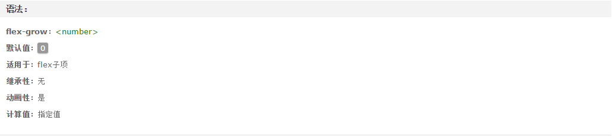
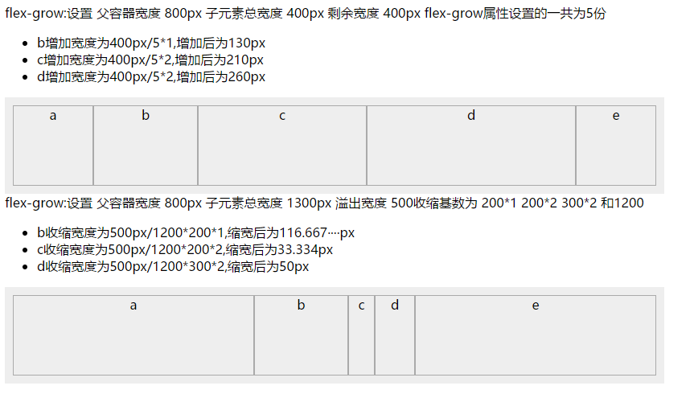

flex
===================================  
新弹性盒模型属性
-----------------------------------
### 主要查看网站

<a href="https://developer.mozilla.org/zh-CN/docs/Web/CSS/flex">Mozilla flex文档</a> https://developer.mozilla.org/zh-CN/docs/Web/CSS/flex

<a href="http://www.css88.com/book/css/properties/flex/index.htm">CSS参考手册</a> http://www.css88.com/book/css/properties/flex/index.htm

### flex 出现的原因：
>使用弹性盒子的意义是在任何尺寸的屏幕上改变其和其子元素的尺寸填充屏幕可用空间。一个弹性框容器将延展它的子元素以填充可用空间，并且缩小它的子元素来避免溢出。
> 
>> ####浮动布局的问题
>>
>>* 难以控制。如果站点上存在一些不可预知的内容，那么布局将变的难以维护。
>>* 源码顺序依赖。弹性布局依赖于HTML源码，在做响应式设计时将难以为不同的媒体查询变更布局。
>>* 列等高问题。如果容器中有两到三列不同的内容，并且在任意内容的条件下，都需要设置为相同的高度。浮动布局难以实现这个要求。
>>* 内容居中。使用浮动布局难以将内容水平且垂直居中。
>>####弹性盒子如何处理
>>
>>* 通过将弹性元素拉伸或缩小来充满可用空间和避免溢出。这种方式解决了新内容的溢出问题并且以开发者期望的情况实施布局。
>>* 给予弹性元素成比例的尺寸。
>>* 弹性容器内的弹性元素可以从任意方向布局。可以解决在不同媒体查询中元素的顺序问题。使得可见内容的顺序独立于HTML渲染顺序，有利于站点的响应式设计。

###flex常用属性说明：

* 弹性容器属性
    * flex-direction
    * flex-wrap
    * flex-flow
    * justify-content
    * align-items
    * align-content
* 弹性元素属性
    * order
    * align-self
    * flex-grow
    * flex-shrink
    * flex-basis

1.  `flex-direction：row | row-reverse | column | column-reverse` 
 
    该属性通过定义flex容器的主轴方向来决定felx子项在flex容器中的位置。这将决定flex需要如何进行排列。 
     
    row：主轴与行内轴方向作为默认的书写模式。即横向从左到右排列（左对齐）。
    
    row-reverse：对齐方式与row相反。
    
    column：主轴与块轴方向作为默认的书写模式。即纵向从上往下排列（顶对齐）。
    
    column-reverse：对齐方式与column相反。

2. `flex-wrap：nowrap | wrap | wrap-reverse`

    该属性控制flex容器是单行或者多行，同时横轴的方向决定了新行堆叠的方向。
    
    nowrap：flex容器为单行。该情况下flex子项可能会溢出容器。
    
    wrap：flex容器为多行。该情况下flex子项溢出的部分会被放置到新行，子项内部会发生断行。
    
    wrap-reverse：反转 wrap 排列。

3. `flex-flow: <' flex-direction '> || <' flex-wrap '>`

    复合属性。设置或检索弹性盒模型对象的子元素排列方式。
    
4. `justify-content：flex-start | flex-end | center | space-between | space-around`

    设置或检索弹性盒子元素在主轴（横轴）方向上的对齐方式。
    
    flex-start：弹性盒子元素将向行起始位置对齐。该行的第一个子元素的主起始位置的边界将与该行的主起始位置的边界对齐，同时所有后续的伸缩盒项目与其前一个项目对齐。
    
    flex-end：弹性盒子元素将向行结束位置对齐。该行的第一个子元素的主结束位置的边界将与该行的主结束位置的边界对齐，同时所有后续的伸缩盒项目与其前一个项目对齐。
   
    center：弹性盒子元素将向行中间位置对齐。该行的子元素将相互对齐并在行中居中对齐，同时第一个元素与行的主起始位置的边距等同与最后一个元素与行的主结束位置的边距（如果剩余空间是负数，则保持两端相等长度的溢出）。
    
    space-between：弹性盒子元素会平均地分布在行里。如果最左边的剩余空间是负数，或该行只有一个子元素，则该值等效于'flex-start'。在其它情况下，第一个元素的边界与行的主起始位置的边界对齐，同时最后一个元素的边界与行的主结束位置的边距对齐，而剩余的伸缩盒项目则平均分布，并确保两两之间的空白空间相等。
    
    space-around：弹性盒子元素会平均地分布在行里，两端保留子元素与子元素之间间距大小的一半。如果最左边的剩余空间是负数，或该行只有一个伸缩盒项目，则该值等效于'center'。在其它情况下，伸缩盒项目则平均分布，并确保两两之间的空白空间相等，同时第一个元素前的空间以及最后一个元素后的空间为其他空白空间的一半。
    
5. `align-items：flex-start | flex-end | center | baseline | stretch`
    
    定义flex子项在flex容器的当前行的侧轴（纵轴）方向上的对齐方式。
    
    flex-start：弹性盒子元素的侧轴（纵轴）起始位置的边界紧靠住该行的侧轴起始边界。
    
    flex-end：弹性盒子元素的侧轴（纵轴）起始位置的边界紧靠住该行的侧轴结束边界。
   
    center：弹性盒子元素在该行的侧轴（纵轴）上居中放置。（如果该行的尺寸小于弹性盒子元素的尺寸，则会向两个方向溢出相同的长度）。
    
    baseline：如弹性盒子元素的行内轴与侧轴为同一条，则该值与'flex-start'等效。其它情况下，该值将参与基线对齐。
 
    stretch：如果指定侧轴大小的属性值为'auto'，则其值会使项目的边距盒的尺寸尽可能接近所在行的尺寸，但同时会遵照'min/max-width/height'属性的限制。
 
6. `align-content：flex-start | flex-end | center | space-between | space-around | stretch`

    当伸缩容器的侧轴还有多余空间时，本属性可以用来调准「伸缩行」在伸缩容器里的对齐方式，这与调准伸缩项目在主轴上对齐方式的 `<' justify-content '>` 属性类似。请注意本属性在只有一行的伸缩容器上没有效果。
    
    flex-start：各行向弹性盒容器的起始位置堆叠。弹性盒容器中第一行的侧轴起始边界紧靠住该弹性盒容器的侧轴起始边界，之后的每一行都紧靠住前面一行。
    
    flex-end：各行向弹性盒容器的结束位置堆叠。弹性盒容器中最后一行的侧轴起结束界紧靠住该弹性盒容器的侧轴结束边界，之后的每一行都紧靠住前面一行。
    
    center：各行向弹性盒容器的中间位置堆叠。各行两两紧靠住同时在弹性盒容器中居中对齐，保持弹性盒容器的侧轴起始内容边界和第一行之间的距离与该容器的侧轴结束内容边界与第最后一行之间的距离相等。（如果剩下的空间是负数，则各行会向两个方向溢出的相等距离。）
    
    space-between：各行在弹性盒容器中平均分布。如果剩余的空间是负数或弹性盒容器中只有一行，该值等效于'flex-start'。在其它情况下，第一行的侧轴起始边界紧靠住弹性盒容器的侧轴起始内容边界，最后一行的侧轴结束边界紧靠住弹性盒容器的侧轴结束内容边界，剩余的行则按一定方式在弹性盒窗口中排列，以保持两两之间的空间相等。
    
    space-around：各行在弹性盒容器中平均分布，两端保留子元素与子元素之间间距大小的一半。如果剩余的空间是负数或弹性盒容器中只有一行，该值等效于'center'。在其它情况下，各行会按一定方式在弹性盒容器中排列，以保持两两之间的空间相等，同时第一行前面及最后一行后面的空间是其他空间的一半。
    
    stretch：各行将会伸展以占用剩余的空间。如果剩余的空间是负数，该值等效于'flex-start'。在其它情况下，剩余空间被所有行平分，以扩大它们的侧轴尺寸
     

7. `order：<integer> `

    设置或检索弹性盒模型对象的子元素出現的順序。 
    
    用整数值来定义排列顺序，数值小的排在前面。可以为负值。
    
8. `align-self：auto | flex-start | flex-end | center | baseline | stretch`
   
    auto：如果'align-self'的值为'auto'，则其计算值为元素的父元素的'align-items'值，如果其没有父元素，则计算值为'stretch'。
    
    flex-start：弹性盒子元素的侧轴（纵轴）起始位置的边界紧靠住该行的侧轴起始边界。
    
    flex-end：弹性盒子元素的侧轴（纵轴）起始位置的边界紧靠住该行的侧轴结束边界。
    
    center：弹性盒子元素在该行的侧轴（纵轴）上居中放置。（如果该行的尺寸小于弹性盒子元素的尺寸，则会向两个方向溢出相同的长度）。
    
    baseline：如弹性盒子元素的行内轴与侧轴为同一条，则该值与'flex-start'等效。其它情况下，该值将参与基线对齐。
    
    stretch：如果指定侧轴大小的属性值为'auto'，则其值会使项目的边距盒的尺寸尽可能接近所在行的尺寸，但同时会遵照'min/max-width/height'属性的限制。

9. `flex-grow：<number>`

    用数值来定义扩展比率。不允许负值
    
10. `flex-shrink：<number>`
    
    用数值来定义收缩比率。不允许负值

11. `flex-basis：<length> | <percentage> | auto | content`
    
    <length>：用长度值来定义宽度。不允许负值
    
    <percentage>：用百分比来定义宽度。不允许负值
    
    auto：无特定宽度值，取决于其它属性值
    
    content：基于内容自动计算宽度
    
12. `flex：none | <' flex-grow '> <' flex-shrink >'? || <' flex-basis '>`

    none：none关键字的计算值为: 0 0 auto
    
    <' flex-grow '>：用来指定扩展比率，即剩余空间是正值时此「flex子项」相对于「flex容器」里其他「flex子项」能分配到空间比例。在「flex」属性中该值如果被省略则默认为「1」
    
    <' flex-shrink '>：用来指定收缩比率，即剩余空间是负值时此「flex子项」相对于「flex容器」里其他「flex子项」能收缩的空间比例。在收缩的时候收缩比率会以伸缩基准值加权在「flex」属性中该值如果被省略则默认为「1」
    
    <' flex-basis '>：用来指定伸缩基准值，即在根据伸缩比率计算出剩余空间的分布之前，「flex子项」长度的起始数值。在「flex」属性中该值如果被省略则默认为「0%」在「flex」属性中该值如果被指定为「auto」，则伸缩基准值的计算值是自身的 <' width '> 设置，如果自身的宽度没有定义，则长度取决于内容。

在定义父元素`dispaly:flex`后使用`flex-flow: <' flex-direction '> || <' flex-wrap '>`定义主轴方向即（左对齐）（顶对齐）和是否换行。`align-items`定义flex子项在flex容器的当前行的侧轴（纵轴）方向上的对齐方式。
flex命令：`flex-grow`用来指定扩展比率,` flex-shrink`用来指定收缩比率,而这两个的分配基准值不同。扩展基准值为flex-grow值，收缩基准值为flex-shrink值*flex-basis。
***下面这两个图重点是默认值分别为0和1***
>

>
###

*** config文件更改 local username 防止gitlab 和 github 用户名冲突 ***

